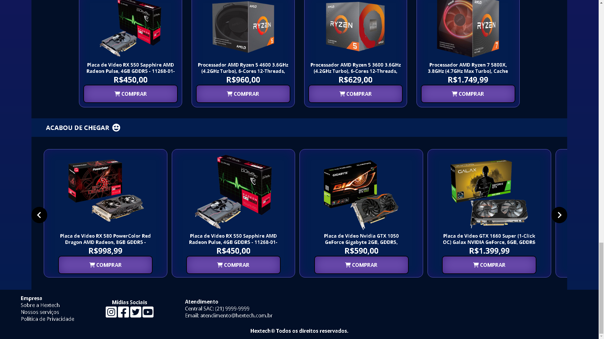
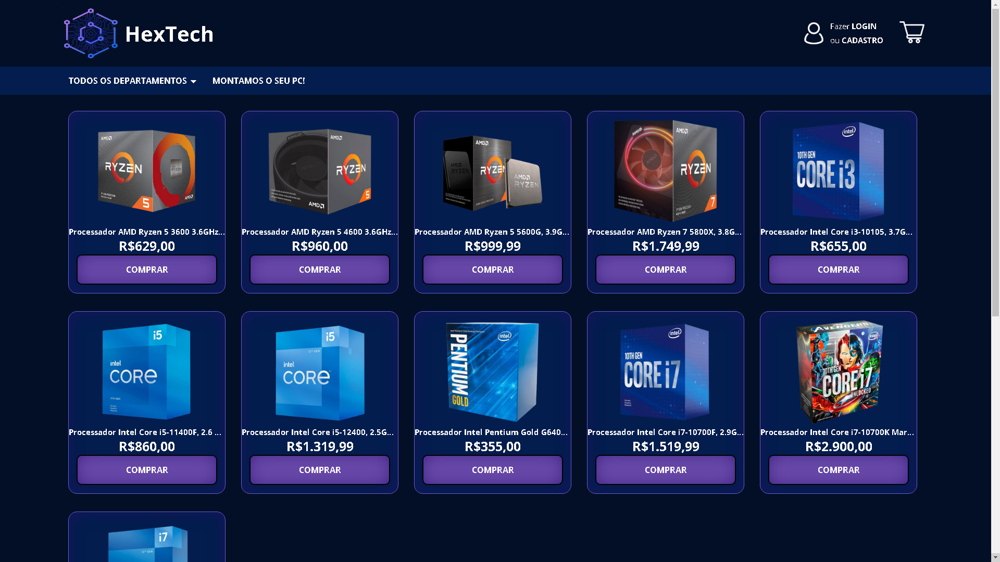
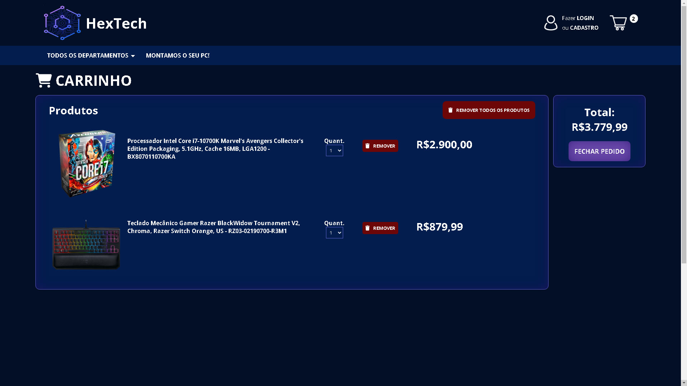
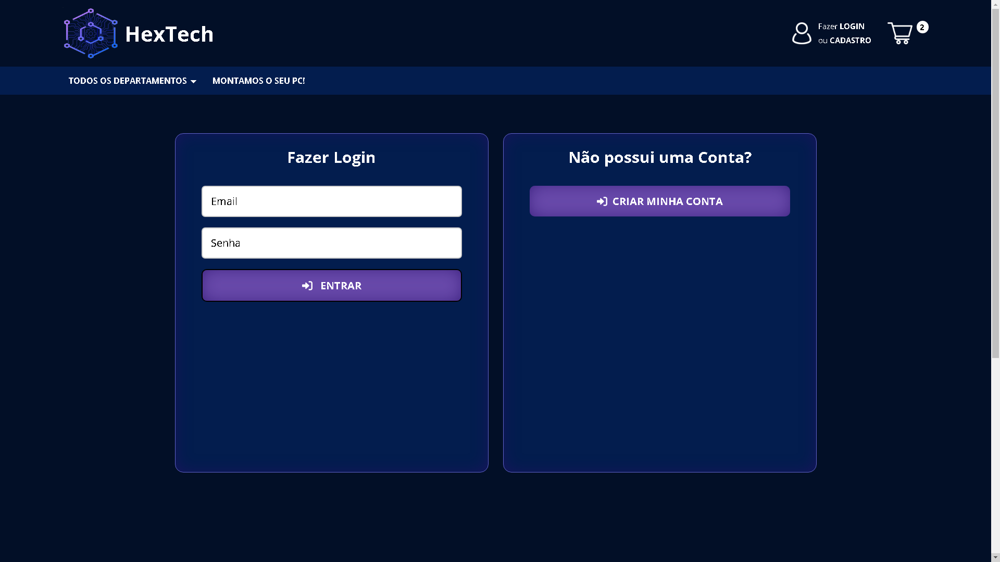
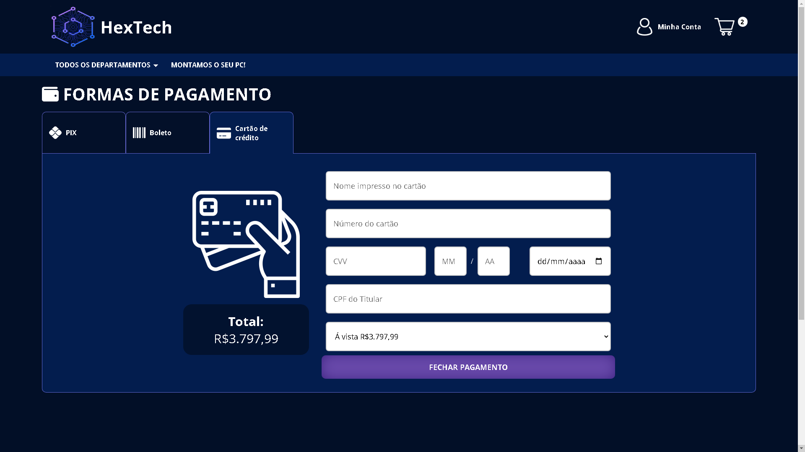

# Aplicação Web de E-commerce

Projeto acadêmico desenvolvido como Trabalho de Conclusão de Curso (TCC), com o objetivo de aplicar conceitos de lógica de programação, organização de dados e desenvolvimento web completo.

## 📌 Descrição

Sistema de e-commerce com funcionalidades básicas de navegação de produtos, criação de contas de usuários e fluxo de compra. O projeto integra frontend e backend, simulando uma aplicação web funcional.

## 🚀 Funcionalidades

* Catálogo de produtos
* Cadastro de usuários
* Carrinho de compras
* Fluxo de finalização de pedido
* Integração com banco de dados

## 🛠 Tecnologias utilizadas

* HTML
* CSS
* JavaScript
* PHP
* MySQL

## ▶ Como executar

1. Instale um servidor local (ex: XAMPP).
2. Copie a pasta do projeto para o diretório do servidor.
3. Importe o arquivo SQL no banco de dados.
4. Inicie o servidor e acesse pelo navegador.

## 📷 Demonstração

### Página inicial

## Página de produtos

## Página de produto

## Carrinho

## Pagina de cadastro e login

## Página de Cálculo de frete

## Página de Pagamento

## Página de Conta e Pedidos

## Página principal completa

