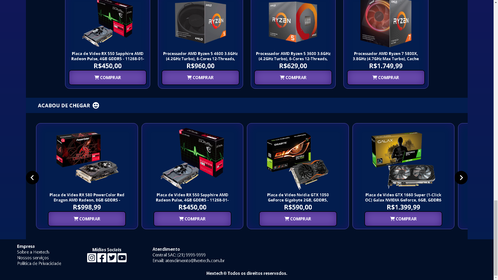
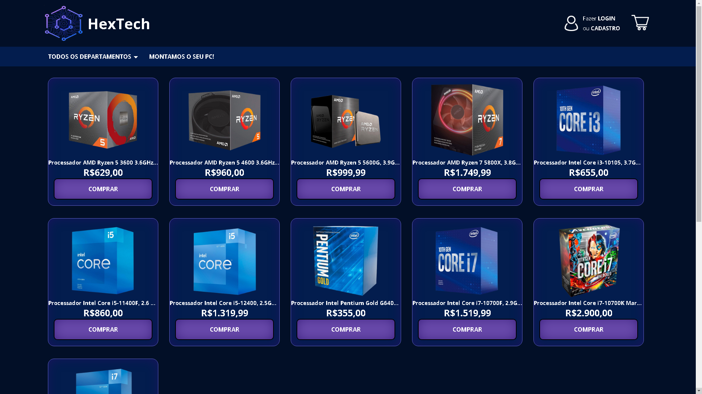
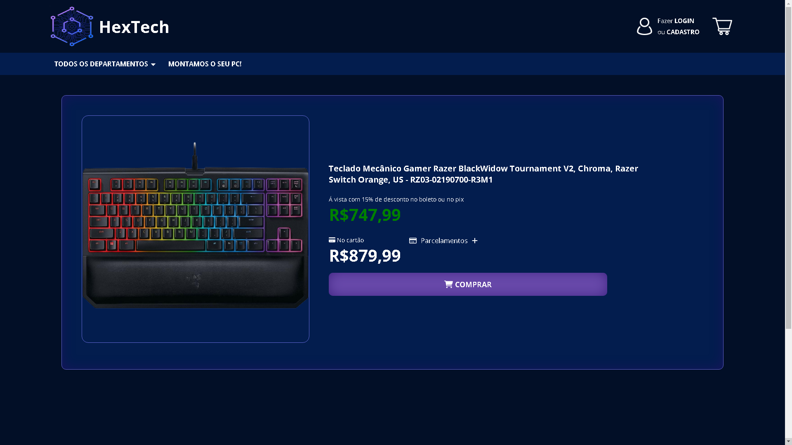
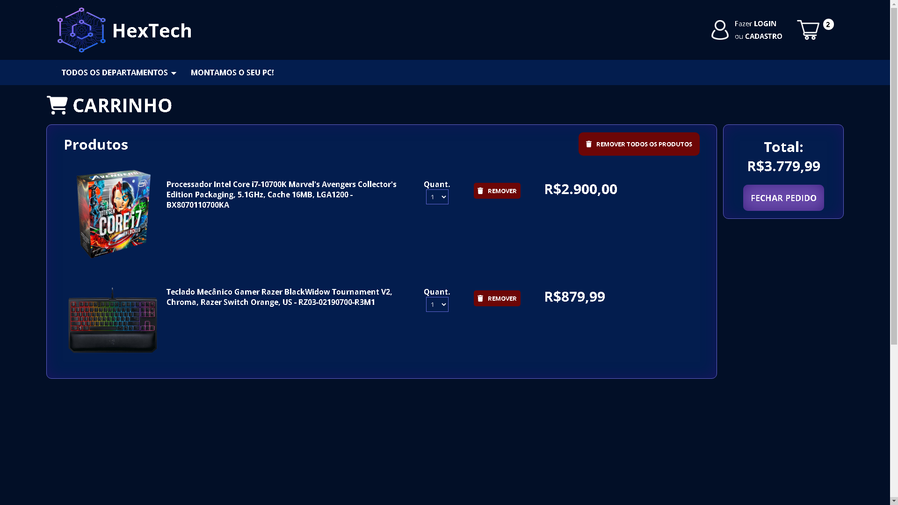
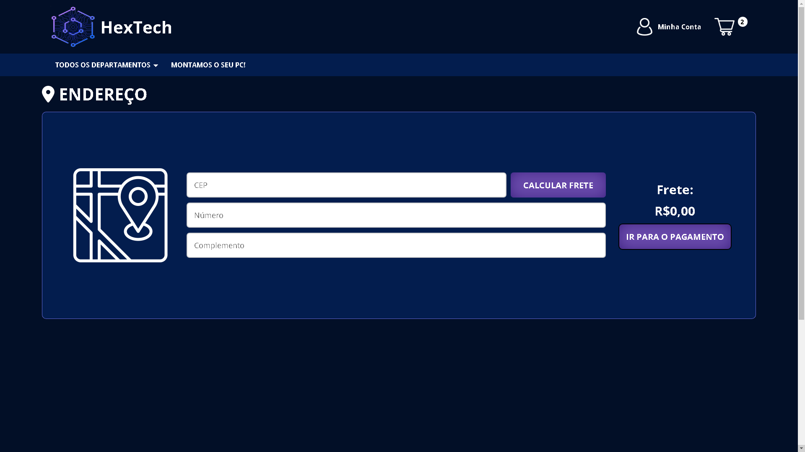
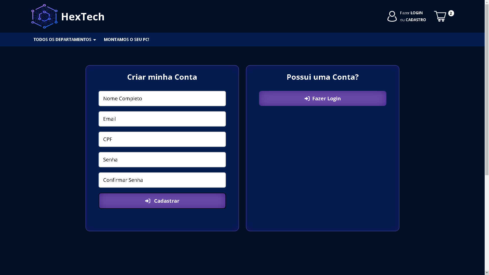
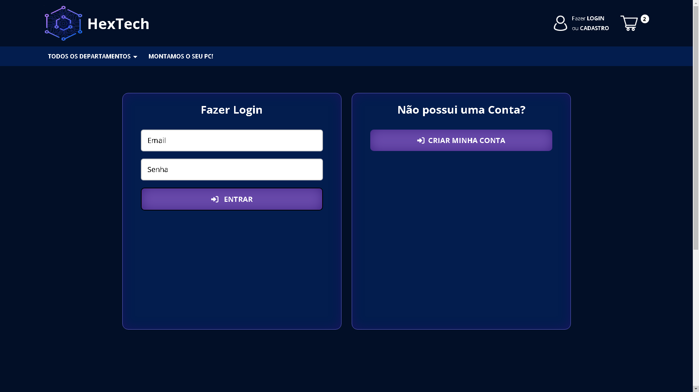
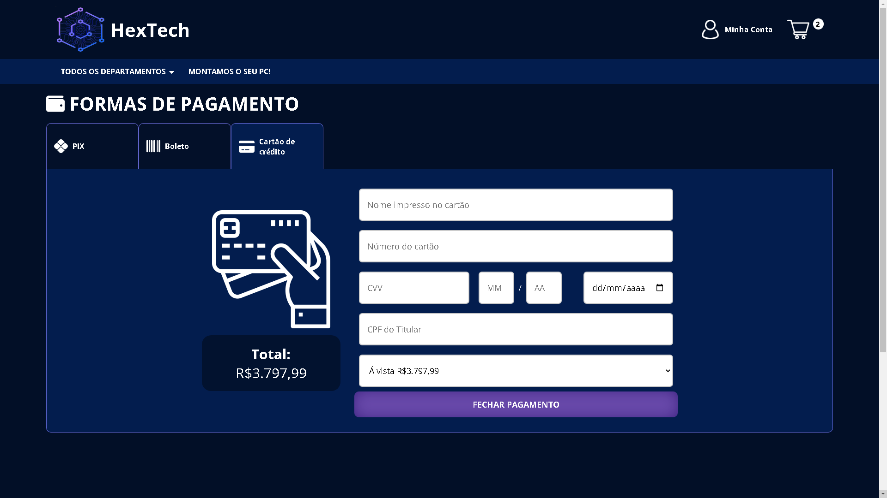

# Hextech E-commerce

A fully functional e-commerce web application built as a technical high school final project in 2022. The project covers the entire shopping experience, from browsing a product catalog to completing a purchase, with a custom-built backend handling authentication, cart management, and order tracking.

## Features

- Product catalog with individual product pages
- User registration and login
- Shopping cart
- Checkout and order tracking

## Tech Stack

- HTML, CSS, JavaScript
- PHP
- MySQL

## Screenshots

### Main Page

### Catalog and Product Details

### Cart and Shipping

### Authentication

### Payment

### User Account

## How to run

1. Install XAMPP
2. Copy the project folder to the server directory
3. Import the SQL file into the database
4. Start the server and open in the browser
